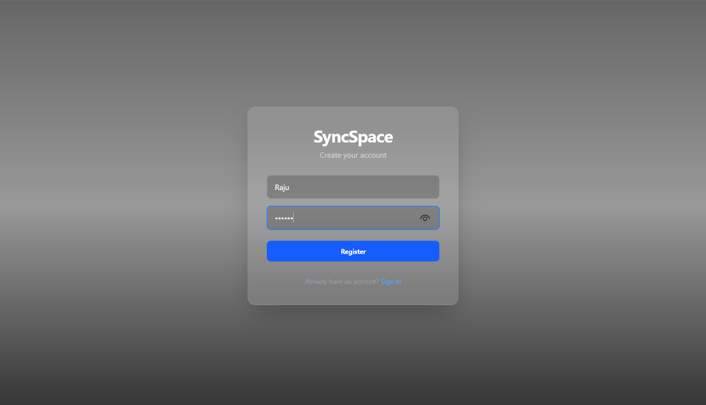
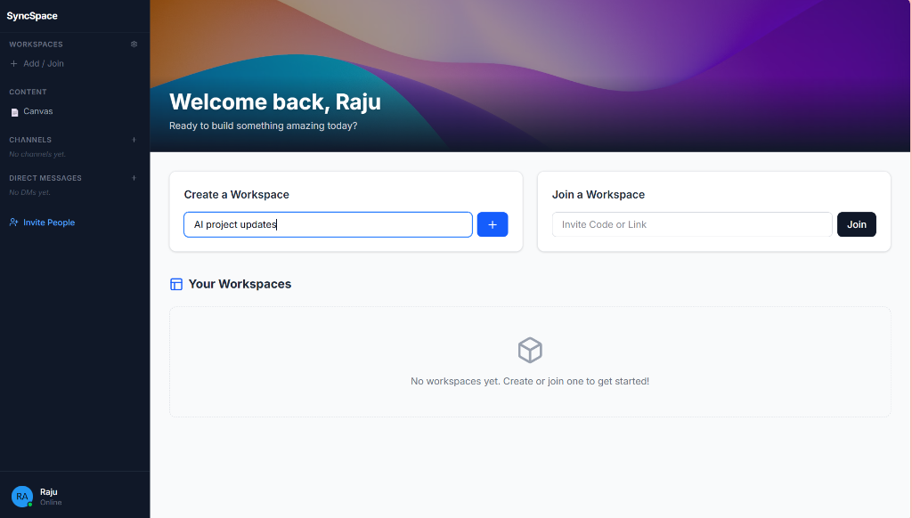
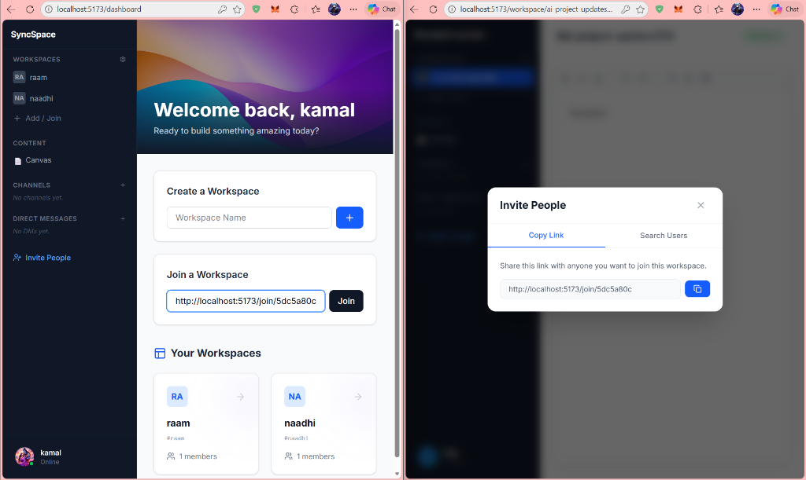
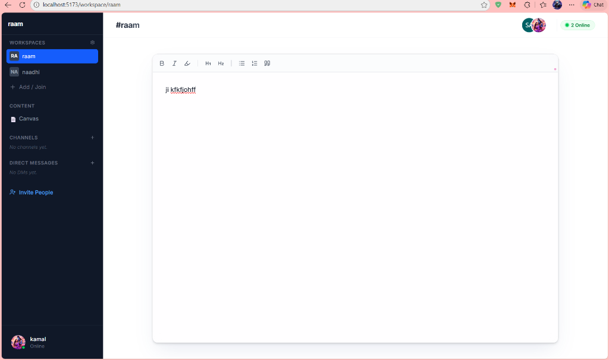
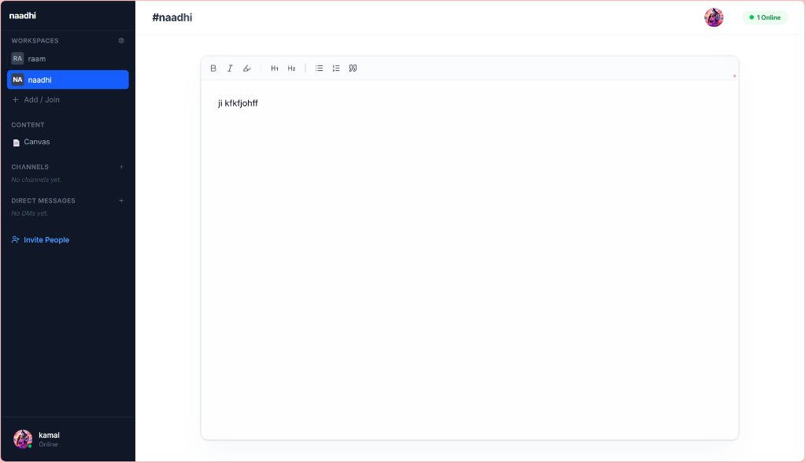
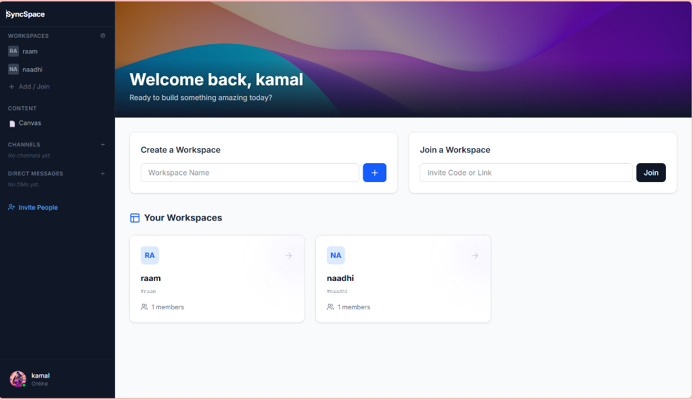
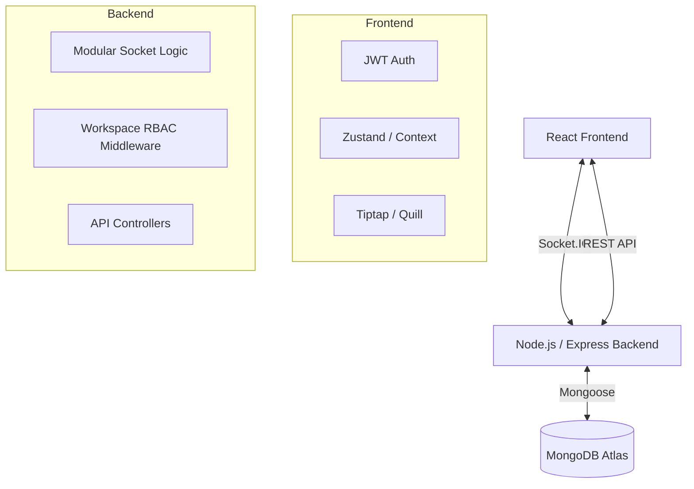
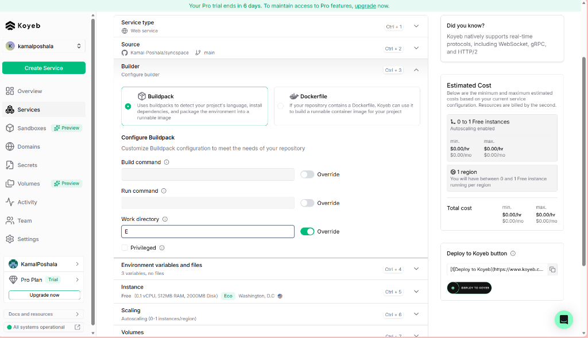
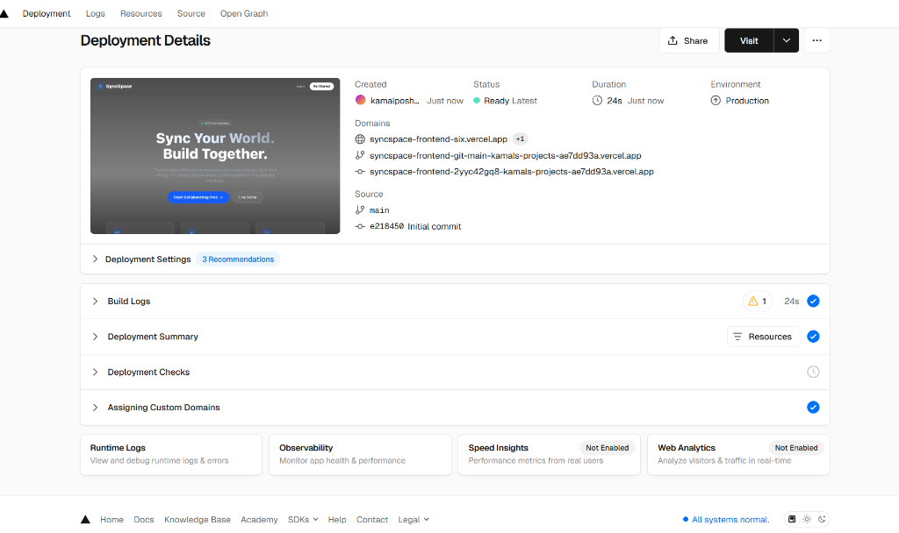

# SyncSpace — Real-Time Collaborative Workspace

SyncSpace is a premium, real-time collaborative workspace built for modern teams. It enables multiple users to edit shared documents, chat in channels/DMs, and manage projects with live presence tracking and persistent storage.

---

## ✨ Visual Overview

### 🔐 Modern Authentication

*Glassmorphism UI with secure JWT-based authentication.*

### 🚀 Dynamic Dashboard

*Unified workspace management with a sleek animated interface.*

### 👥 Real-Time Collaboration & Invites

*Live active user tracking, instant messaging, and collaborative canvas view.*

---

## 🛠️ Workspace Management

| Workspace Details | Isolation & Presence | Invite Management |
| :---: | :---: | :---: |
|  |  |  |
| *Switching between workspaces* | *Isolated environments* | *Managing member invites* |

---

## 🚀 Key Features

- **🔐 Robust Security**: JWT-based authentication across REST and WebSockets.
- **⚡ Real-Time Engine**: High-performance collaboration powered by Socket.IO.
- **👥 Presence & Typing**: Visual cues for who is online and actively participating.
- **📁 Workspace Isolation**: Secure, slug-based rooms for different team projects.
- **💬 Modular Chat**: Integrated Channels and Direct Messages (1:1 chat).
- **💾 Auto-Persistence**: Throttled DB writes to MongoDB for data safety without performance lag.

---

## 🏗️ System Architecture



---

## 🛠️ Tech Stack

### Frontend
- **Framework**: React (TypeScript)
- **Styling**: TailwindCSS & Framer Motion
- **Editor**: Tiptap (Rich Text)
- **State**: Context API & Custom Hooks
- **Real-time**: Socket.IO Client

### Backend
- **Core**: Node.js + Express
- **Real-time**: Socket.IO
- **Auth**: JSON Web Tokens (JWT)
- **Persistence**: MongoDB with Mongoose ORM
- **Hosting**: Koyeb (Persistent WebSockets)

---

## ⚙️ Performance Optimizations

- **Debounced Inputs**: Reduces socket event frequency during active typing.
- **Throttled DB Operations**: Protects database from write-heavy real-time updates.
- **Single Connection**: Persistent socket connection with intelligent room switching for workspace changes.

---

## 🌐 Cloud Infrastructure

| Koyeb (Backend) | Vercel (Frontend) |
| :---: | :---: |
|  |  |
| *Persistent WebSocket Hosting* | *Static Site Hosting* |

---

## ▶️ Running Locally (Development)

### 1️⃣ Configure Environment
Create a `.env` in `server/` following the `.env.example`:
```bash
MONGODB_URI=your_mongodb_uri
JWT_SECRET=your_secret
CLIENT_URL=http://localhost:5173
```

### 2️⃣ Start Backend
```bash
cd server
npm install
npm run dev
```

### 3️⃣ Start Frontend
```bash
cd client
npm install
npm run dev
```

---

### 👤 Author
- **Kamal Poshala**
- Master’s in Computer Science
- University of Oklahoma

---

### 🛠️ Maintenance & Deployment

Built and maintained with **Antigravity AI**. Deployed on **Koyeb** (Backend) and **Vercel** (Frontend).
